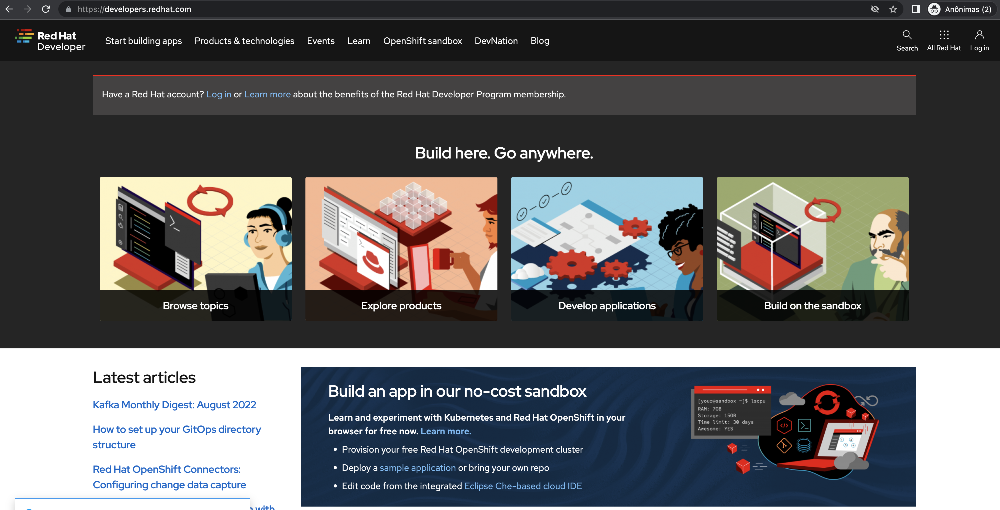
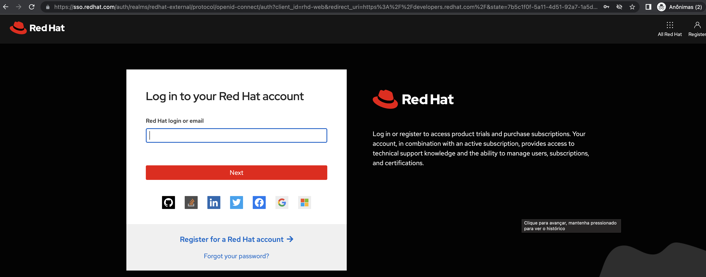
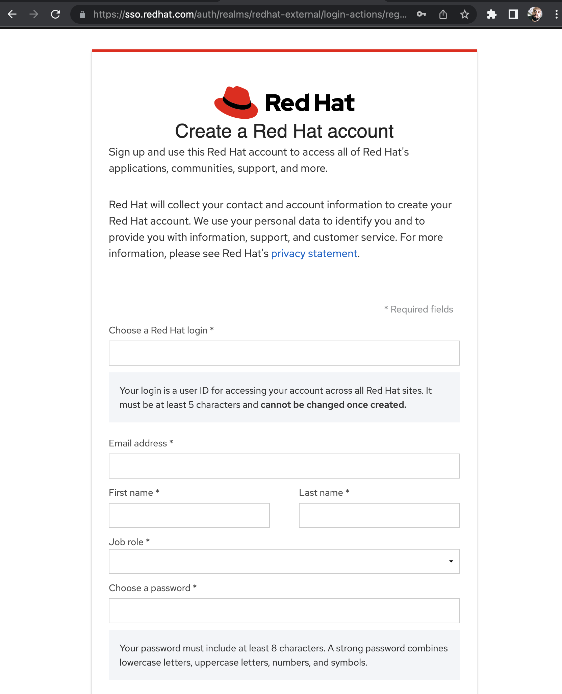
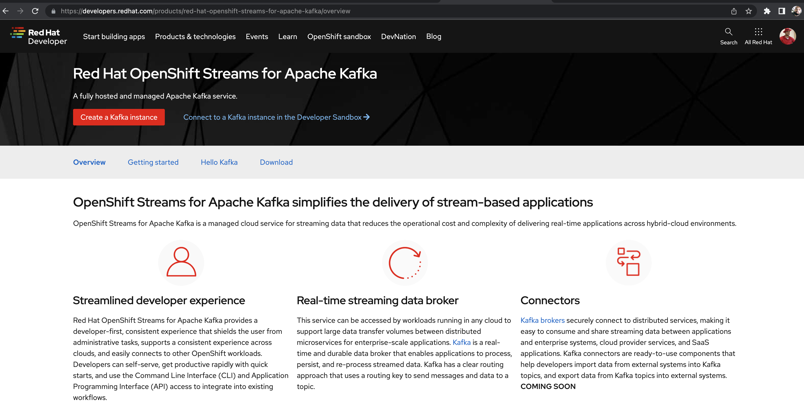
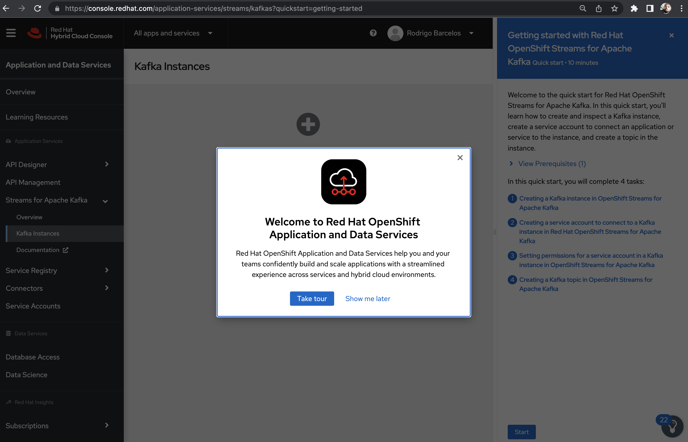

:walkthrough: Red Hat OpenShift Streams for Apache Kafka
:codeready-url: {che-url}
:openshift-url: {openshift-host}
:user-password: openshift

= Red Hat OpenShift Streams for Apache Kafka

Learn how to use asynchronous communication in a event driven architecture using Kafka as the event broker.

Know and explore the Managed Kafka Offering from Red Hat, Red Hat Openshift Streams for Apache Kafka (RHOSAK).

== Event Driven Architecture Introduction

Event Driven Architecture Introduction

In an Event Driven Architecture, an event notification is generated, the system captures what happened and waits to provide the response back.  The application that got the notification might either reply right away or wait till the status changes.

Event Driven Architecture allows for more flexible, scalable, contextual, and responsive digital business systems. This is why this architecture style has been gaining popularity.

The key rationale for leveraging Apache Kafka for an Event Driven system is the decoupling of microservices and the development of a Kafka pipeline to connect producers and consumers. Instead of checking for new data, you may just listen to a certain event and take action. Kafka provides a scalable hybrid approach that incorporates both Processing and Messaging.

Another advantage of using Event Driven Architecture with Kafka is that, unlike messaging-oriented systems, events published in Kafka are not removed as soon as they are consumed. They are removed once a specific amount of time has passed.

During their lifetime, they may be read by a variety of consumers, allowing them to respond to a variety of use cases.

[time=5]
== Access the Red Hat Developers portal

Access the portal and log-in. In case you do not have registered yet, please do your registration.

https://developers.redhat.com

Do the Login

In case that that you need to do your registration, you should see a form like that:

Access the Red Hat Streams for Apache Kafka Page, and click on `Create instance`.

If it's your first access, you should see a screen like this:

Access the Learning resources section from the left side menu.

image::./images/learning-resources.png

Select the `Getting Started with Red Hat Openshift Streams for Apache Kafka` quickstart.

image::./images/learning-resources-2.png

[time=25]
== Getting Started with Red Hat Openshift Streams for Apache Kafka

Follow the lab instructions from the portal. You in the end of this lab you must conclude the following steps:

* Create a Kafka instance
* Copied the connection information
* Create a Service Account 
* Copied the ClientID and Client Secret from the Service Account
* Set the Access Control for the Kafka instance

== Getting started with Red Hat OpenShift Connectors

Access the Learning resources section from the left side menu.

Select the `Getting started with Red Hat OpenShift Connectors` quickstart.

image::./images/learning-resources-3.png

